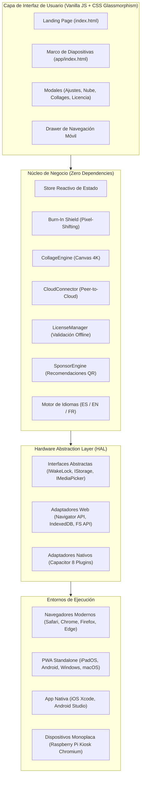

<p align="center">
  
</p>

<p align="center">
  <strong>El marco digital inteligente, privado y de alta fidelidad diseñado para transformar iPads antiguos, tablets Android y pantallas táctiles en dispositivos de exhibición continua 24/7.</strong>
</p>

<p align="center">
  <a href="README.md"></a>
  <a href="README.es.md"></a>
  <a href="README.fr.md"></a>
</p>

<p align="center">
  <a href="README.md">English</a> • <strong>Español</strong> • <a href="README.fr.md">Français</a>
</p>

<p align="center">
  <a href="#-arquitectura-del-sistema"></a>
  <a href="#-filosofía-upcycling"></a>
  <a href="#-seguridad-y-privacidad-zero-knowledge"></a>
  <a href="#-especificaciones-técnicas"></a>
  <a href="#-matriz-de-licenciamiento"></a>
</p>

---

## ✦ Manifiesto y Visión

La mayoría de los marcos de fotos digitales comerciales son costosos, lentos, frágiles y dependen de servidores en la nube propietarios que quedan obsoletos o cobran suscripciones mensuales obligatorias. Mientras tanto, millones de iPads y tablets de alta gama permanecen olvidados en cajones con pantallas de retina excepcionales y procesadores capaces.

**leptiumFrame** nace bajo una premisa de ingeniería de nivel de producción:
1. **Upcycling Primero**: Dar una segunda vida útil de 5 a 10 años a hardware existente sin generar basura electrónica.
2. **Privacidad Absoluta**: Arquitectura *Zero-Knowledge*. Las fotos familiares residen en el almacenamiento del dispositivo o se transmiten de punto a punto desde tu nube personal sin intermediarios.
3. **Calidad Nativa Apple / Android**: Experiencia visual construida con estándares Apple Human Interface Guidelines, tipografías del sistema SF Pro, paleta OLED profunda, Glassmorphism acelerado por hardware y cero emojis en la interfaz de usuario.
4. **Cero Dependencias de Ejecución**: Escrito en puro Vanilla JavaScript (ES2022), HTML5 semántico y CSS3 moderno para una tasa constante de 60 cuadros por segundo con consumo mínimo de batería y memoria.

---

## ✦ Pilares de Ingeniería

```
┌────────────────────────────────────────────────────────────────────────┐
│                              leptiumFrame                              │
├──────────────────────────────────┬─────────────────────────────────────┤
│  Hardware Abstraction Layer      │  Protección de Pantalla 24/7        │
│  (HAL Ports & Adapters)          │  (Burn-In Shield Pixel-Shifting)    │
├──────────────────────────────────┼─────────────────────────────────────┤
│  Privacidad Híbrida Directa      │  Ensamblador de Collages 4K         │
│  (Air-Gapped + Peer-to-Cloud)    │  (Renderizado en Canvas 2x2)        │
├──────────────────────────────────┼─────────────────────────────────────┤
│  Modo Limpieza Capacitiva        │  Motor de Patrocinios Inteligente   │
│  (Touch Lockout 30s con Vector)  │  (Zero-Distraction QR Ambient)      │
└──────────────────────────────────┴─────────────────────────────────────┘
```

### 1. Hardware Abstraction Layer (HAL)
El núcleo de la aplicación implementa el patrón de arquitectura hexagonal (*Ports & Adapters*). Desacopla por completo la interfaz gráfica de usuario de las interfaces nativas del sistema operativo:

* **WakeLock**: Mantiene la pantalla encendida de forma indefinida. Utiliza la API web `navigator.wakeLock` en navegadores modernos y `@capacitor-community/keep-awake` en compilaciones nativas de iOS/Android, gestionando la re-adquisición automática ante eventos del ciclo de vida (`visibilitychange`, `appStateChange`).
* **Storage**: Almacena preferencias, favoritos, listas de exclusión y configuraciones en `IndexedDB` con replicación en `localStorage` (Web) o `@capacitor/preferences` (Nativo).
* **MediaPicker**: Conecta con el sistema de archivos del usuario mediante File System Access API / Blob en el navegador o el selector nativo `@capacitor/camera` y `@capacitor/filesystem`.

### 2. Escudo Anti-Quemado (Burn-In Shield 24/7)
Para prevenir la degradación de fósforo o retención de imagen en paneles OLED, AMOLED y pantallas LCD IPS que operan de forma ininterrumpida los 365 días del año:
* Desplaza imperceptiblemente los elementos estáticos (reloj tipográfico, indicadores de clima, controles) entre 1 y 2 píxeles cada 15 minutos en un patrón orbital imperceptible.
* Aplica micro-modulaciones de brillo y contraste durante las horas de descanso (atenuación automática programable de 10:00 PM a 7:00 AM).

### 3. Ensamblador de Collages 2x2 en 4K
* Compone fotografías del carrete local o curadas en mosaicos simétricos de ultra-alta definición renderizados en un canvas aislado en memoria.
* Incluye manejo automático de orientación EXIF, prevención de desbordamiento de memoria en Safari WebKit y opción de exportación directa en formato JPEG de imprenta.

### 4. Modo Limpieza Capacitiva (Apple-Style Clean Overlay)
* Permite limpiar el polvo y las huellas de la pantalla con un paño húmedo sin activar toques accidentales ni interrumpir la visualización.
* Bloquea temporalmente los eventos táctiles durante 30 segundos, mostrando un temporizador vectorial minimalista y confirmación de desbloqueo.

---

## ✦ Arquitectura del Sistema



---

## ✦ Seguridad y Privacidad Zero-Knowledge

La arquitectura de **leptiumFrame** prioriza el control absoluto de los datos personales:

```
[ Carrete Local / Tablet ]  ───────►  [ Memoria Sandbox del Navegador ]  (Cero Tráfico Saliente)
                                                       ▲
                                                       │
                                   (Opcional: Sincronización Pro)
                                                       │
                                        [ Nube Personal Directa ]
                             (Google Photos, iCloud Enlace Público, WebDAV)
```

1. **Modo Aislado (Air-Gapped)**: Funciona 100% offline. Tus fotos nunca se envían a servidores de leptiumFrame porque la plataforma carece deliberadamente de backend de almacenamiento de imágenes.
2. **Conexión Directa a Nube Personal**: Permite sincronizar álbumes compartidos o feeds de Nextcloud/WebDAV mediante peticiones cliente a servidor (*Peer-to-Cloud*).
3. **Credenciales en Almacenamiento Local**: Tokens y URLs de sincronización se resguardan exclusivamente en el sandbox criptográfico del navegador del dispositivo.

---

## ✦ Estructura del Repositorio

```
leptiumFrame/
├── index.html                   # Landing page trilingüe con pasarela y comunidad
├── app/
│   └── index.html               # Aplicación de marco fotográfico de pantalla completa
├── src/
│   ├── main.js                  # Punto de entrada modular de la aplicación
│   ├── core/
│   │   ├── burnin/
│   │   │   └── burnInShield.js  # Algoritmo de desplazamiento de micro-píxeles
│   │   ├── collage/
│   │   │   └── collageEngine.js # Procesador de mosaicos y renderizado canvas
│   │   ├── cloud/
│   │   │   └── cloudConnector.js# Conectores directos a Google Photos, iCloud y WebDAV
│   │   ├── license/
│   │   │   └── licenseManager.js# Validación y gestión de licencias locales
│   │   ├── ads/
│   │   │   └── sponsorEngine.js # Motor de recomendaciones ambientales con QR
│   │   ├── state/
│   │   │   └── store.js         # Estado reactivo y persistencia
│   │   ├── weather/
│   │   │   └── weatherService.js# Servicio de clima dinámico y geolocalización
│   │   └── i18n/
│   │       ├── i18n.js          # Motor ligero de internacionalización
│   │       └── locales/
│   │           ├── es.js        # Diccionario Español
│   │           ├── en.js        # Diccionario Inglés
│   │           └── fr.js        # Diccionario Francés
│   ├── hal/
│   │   ├── index.js             # Inyector dinámico según plataforma (Web vs Nativo)
│   │   ├── interfaces/          # Contratos TypeScript / JSDoc de abstracción
│   │   ├── web/                 # Adaptadores estándar W3C para navegadores
│   │   └── native/              # Adaptadores para Capacitor 8 (iOS y Android)
│   └── ui/
│       └── styles/
│           ├── main.css         # Estilos Glassmorphism de la aplicación
│           └── landing.css      # Estilos de la landing page y componentes
├── public/
│   ├── favicon.svg              # Isotipo vectorial de la aplicación
│   ├── og-image.svg             # Banner vectorial de alta fidelidad
│   ├── manifest.webmanifest     # Configuración PWA standalone
│   ├── sw.js                    # Service Worker con caché offline
│   └── _headers                 # Políticas de seguridad HTTP y Permissions-Policy
├── capacitor.config.json        # Configuración central de Capacitor 8
├── vite.config.js               # Configuración de compilación Vite 5 (base relativa)
└── package.json                 # Scripts de desarrollo y dependencias
```

---

## ✦ Matriz de Licenciamiento

leptiumFrame cuenta con un modelo de monetización transparente impulsado por **Lemon Squeezy**, diseñado para sostener el desarrollo del proyecto sin suscripciones recurrentes forzadas:

| Característica | Free / Comunidad | Básico | Premium Pro (Recomendado) | Maker / Source License |
| :--- | :---: | :---: | :---: | :---: |
| **Precio** | **$0** (Gratis para siempre) | **$4.99** (Pago único) | **$9.99** (Pago único) | **$39.00** (Pago único) |
| **Publicidad / Códigos QR** | Recomendaciones sutiles | Cero publicidad | Cero publicidad | Cero publicidad |
| **Límite de Fotos Locales** | Hasta 200 fotos | Hasta 1,000 fotos | **Ilimitadas** | **Ilimitadas** |
| **Conexión a Nube Personal** | — (Solo local) | — (Solo local) | **Google Photos, iCloud, WebDAV** | **Incluida** |
| **Escudo Anti-Quemado 24/7** | — | — | **Pixel-Shifting Activo** | **Pixel-Shifting Activo** |
| **Ensamblador Collages 4K** | Con marca de agua | Con marca de agua | **Exportación 4K Limpia** | **Exportación 4K Limpia** |
| **Dispositivos Simultáneos** | 1 dispositivo | 1 dispositivo | **Hasta 5 dispositivos** | **Ilimitados** |
| **Acceso al Código Fuente** | — | — | — | **Repositorio Completo** |
| **Derechos de Self-Hosting** | — | — | — | **Comercial / DIY** |

---

## ✦ Puesta en Marcha y Desarrollo

### Requisitos Previos
* **Node.js**: Versión 18.0.0 o superior.
* **NPM**: Versión 9.0.0 o superior.

### 1. Clonar el Repositorio
```bash
git clone https://github.com/leptium/leptiumFrame.git
cd leptiumFrame
```

### 2. Instalar Dependencias
```bash
npm install
```

### 3. Servidor de Desarrollo Local
Inicia el entorno de desarrollo con recarga en caliente (*Hot Module Replacement*):
```bash
npm run dev
```
Abre en tu navegador `http://localhost:5173/` para visualizar la landing page o `http://localhost:5173/app/` para acceder directamente al marco digital.

### 4. Compilación para Producción
Genera el paquete optimizado y minificado en el directorio `dist/`:
```bash
npm run build
```

Para previsualizar la compilación de producción localmente:
```bash
npm run preview
```

---

## ✦ Despliegue en Dispositivos y Plataformas

### Modo 1: Instalación como PWA en iPad o Tablet (Recomendado)
1. Abre Safari (en iPad) o Chrome (en Android / Fire Tablet) y navega a la URL de la aplicación.
2. Toca el botón **Compartir** (icono de cuadro con flecha hacia arriba en iOS o menú de 3 puntos en Android).
3. Selecciona **"Añadir a la pantalla de inicio"**.
4. *(Opcional en iPadOS)*: Activa **Acceso Guiado** (*Ajustes ➔ Accesibilidad ➔ Acceso Guiado*) y presiona tres veces el botón superior/lateral para fijar el marco digital como dispositivo de kiosco sin posibilidad de salir de la aplicación.

### Modo 2: Despliegue en Kiosco con Raspberry Pi (Chromium Fullscreen)
Para convertir cualquier pantalla HDMI convencional en un marco inteligente:
```bash
# Iniciar Chromium en modo Kiosk sin cursor ni barras de interfaz
chromium-browser --noerrdialogs --disable-infobars --kiosk http://localhost:5173/app/ &
```

### Modo 3: Compilación Nativa Móvil (Capacitor 8)
Para compilar binarios nativos de iOS (`.ipa`) o Android (`.apk`):
```bash
# Sincronizar los assets web con las plataformas nativas
npm run build
npm run cap:sync

# Abrir el proyecto en Android Studio
npm run cap:android

# Abrir el proyecto en Xcode (requiere macOS)
npm run cap:ios
```

---

## ✦ Filosofía Upcycling

El impacto ecológico y económico de revitalizar hardware en lugar de desecharlo:

```
Métricas de Impacto Sostenible (Por Unidad Revivida):
─────────────────────────────────────────────────────
• Gasto en hardware nuevo:      $0.00 USD (Ahorro del 100%)
• Residuos electrónicos (WEEE): 0 gramos generados
• Aumento en ciclo de vida útil: +5 a 10 años operativos
• Consumo energético en reposo:  ~2 a 4 Watts (Modo Noche)
```

---

## ✦ Comunidad y Convergencia Social

¿Construiste tu propio marco o reviviste una tablet antigua?
* Comparte tu montaje en redes sociales utilizando el hashtag **`#leptiumFrame`**.
* Conéctate con la comunidad oficial:
  * **X (Twitter)**: [@leptiumFrame](https://x.com/leptiumFrame)
  * **Instagram**: [@leptiumFrame](https://instagram.com/leptiumFrame)
  * **GitHub**: [leptium/leptiumFrame](https://github.com/leptium/leptiumFrame)
  * **Reddit**: [r/leptiumFrame](https://reddit.com/r/leptiumFrame)

---

## ✦ Licencia

Este software se distribuye bajo un esquema dual:
* **Uso Personal y Comunitario**: Libre para uso doméstico a través de la versión PWA alojada o compilada localmente.
* **Licencia Maker / Comercial**: Para implementaciones comerciales, self-hosting en instalaciones comerciales o redistribución de código modificado, adquiere una licencia en [leptiumframe.lemonsqueezy.com](https://leptiumframe.lemonsqueezy.com/buy/maker).

<p align="center">
  <sub>Desarrollado con dedicación técnica y compromiso ecológico por el equipo de <strong>leptiumFrame</strong>.</sub>
</p>
