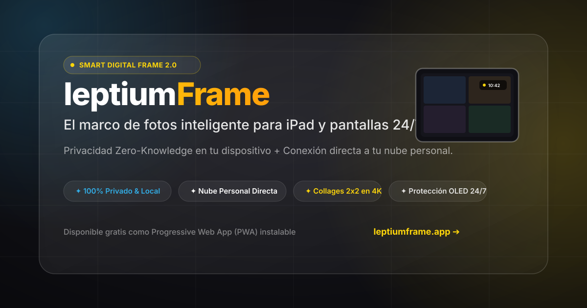
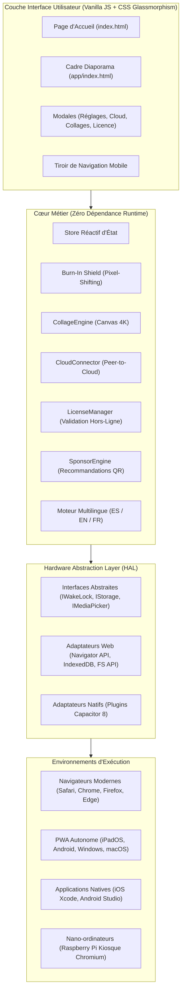

<p align="center">
  
</p>

<p align="center">
  <strong>Le cadre photo numérique intelligent, privé et haute fidélité conçu pour transformer d'anciens iPads, tablettes Android et écrans tactiles en galeries d'exposition continue 24/7.</strong>
</p>

<p align="center">
  <a href="README.md"></a>
  <a href="README.es.md"></a>
  <a href="README.fr.md"></a>
</p>

<p align="center">
  <a href="README.md">English</a> • <a href="README.es.md">Español</a> • <strong>Français</strong>
</p>

<p align="center">
  <a href="#-architecture-du-syst%C3%A8me"></a>
  <a href="#-philosophie-dupcycling"></a>
  <a href="#-s%C3%A9curit%C3%A9-et-confidentialit%C3%A9-zero-knowledge"></a>
  <a href="#-sp%C3%A9cifications-techniques"></a>
  <a href="#-grille-tarifaire-et-licences"></a>
</p>

---

## ✦ Manifeste et Vision

La plupart des cadres photo numériques commerciaux sont coûteux, lents, fragiles et tributaires de serveurs cloud propriétaires qui finissent par être abandonnés ou exigent des abonnements mensuels récurrents. Pendant ce temps, des millions d'iPads et de tablettes dorment dans des tiroirs—dotés de superbes écrans Retina, de processeurs performants et de batteries durables.

**leptiumFrame** est né d'une exigence d'ingénierie professionnelle :
1. **L'Upcycling en Priorité** : Offrir 5 à 10 ans de vie utile supplémentaire au matériel existant tout en éliminant les déchets électroniques.
2. **Confidentialité Absolue** : Architecture *Zero-Knowledge*. Vos photos de famille restent stockées localement sur l'appareil ou transitent en point à point depuis votre cloud personnel, sans serveur intermédiaire.
3. **Finition Native Apple / Android** : Interface conçue selon les *Apple Human Interface Guidelines*—typographie SF Pro, mode sombre OLED profond, Glassmorphism accéléré matériellement et aucun emoji dans l'interface utilisateur.
4. **Zéro Dépendance d'Exécution** : Développé en pur Vanilla JavaScript (ES2022), HTML5 sémantique et CSS3 moderne pour un taux constant de 60 images par seconde avec une consommation minimale de batterie et de mémoire.

---

## ✦ Piliers d'Ingénierie

```
┌────────────────────────────────────────────────────────────────────────┐
│                              leptiumFrame                              │
├──────────────────────────────────┬─────────────────────────────────────┤
│  Hardware Abstraction Layer      │  Protection d'Écran 24/7            │
│  (HAL Ports & Adapters)          │  (Burn-In Shield Pixel-Shifting)    │
├──────────────────────────────────┼─────────────────────────────────────┤
│  Confidentialité Hybride         │  Générateur de Pêle-Mêle 4K         │
│  (Air-Gapped + Peer-to-Cloud)    │  (Traitement Canvas 2x2 en mémoire) │
├──────────────────────────────────┼─────────────────────────────────────┤
│  Mode Nettoyage Capacitif        │  Moteur de Recommandations Ambiant  │
│  (Verrouillage Tactile 30s)      │  (Zero-Distraction QR Ambiant)      │
└──────────────────────────────────┴─────────────────────────────────────┘
```

### 1. Hardware Abstraction Layer (HAL)
Le cœur de l'application met en œuvre une architecture hexagonale (*Ports & Adapters*), séparant rigoureusement l'interface utilisateur des API natives du système d'exploitation :

* **WakeLock** : Maintient l'écran allumé indéfiniment. Utilise l'API standard W3C `navigator.wakeLock` sur les navigateurs web et `@capacitor-community/keep-awake` sur les builds natifs iOS/Android, avec ré-acquisition automatique lors des changements de visibilité (`visibilitychange`, `appStateChange`).
* **Storage** : Persiste les réglages, favoris, photos masquées et clés via `IndexedDB` avec réplication sur `localStorage` (Web) ou `@capacitor/preferences` (Natif).
* **MediaPicker** : Accède aux fichiers de photos via la *File System Access API* / Blob sur le web, ou via les sélecteurs natifs `@capacitor/camera` et `@capacitor/filesystem`.

### 2. Bouclier Anti-Brûlure (Protection 24/7)
Pour prévenir la rémanence d'image et l'usure prématurée des dalles OLED, AMOLED et LCD IPS allumées sans interruption 365 jours par an :
* Décale de manière imperceptible les éléments fixes (horloge typographique, météo, contrôles) de 1 à 2 pixels toutes les 15 minutes selon un schéma orbital régulier.
* Module subtilement la luminosité et le contraste pendant la nuit (atténuation automatique programmable de 22h00 à 07h00).

### 3. Assembleur de Pêle-Mêle 2x2 en 4K
* Compose des mosaïques symétriques haute résolution à partir de la pellicule locale ou d'images sélectionnées, générées dans un Canvas HTML5 isolé en mémoire.
* Intègre la correction d'orientation EXIF, la prévention des fuites de mémoire sous Safari WebKit et l'exportation directe en JPEG haute résolution pour impression.

### 4. Mode Nettoyage Capacitif (Écran Propre Style Apple)
* Permet d'essuyer la poussière et les traces de doigts avec un chiffon doux sans déclencher de gestes tactiles involontaires ni quitter le diaporama.
* Verrouille temporairement toute interaction tactile pendant 30 secondes avec un compte à rebours vectoriel minimaliste et confirmation de déverrouillage.

---

## ✦ Architecture du Système



---

## ✦ Sécurité et Confidentialité Zero-Knowledge

L'architecture de **leptiumFrame** garantit le contrôle total et exclusif de vos données :

```
[ Pellicule Locale / Tablette ]  ───────►  [ Mémoire Bac à Sable du Navigateur ]  (Zéro Trafic Sortant)
                                                              ▲
                                                              │
                                            (Optionnel : Synchronisation Pro)
                                                              │
                                                [ Cloud Personnel Direct ]
                                    (Google Photos, Lien Public iCloud, WebDAV)
```

1. **Fonctionnement Air-Gapped (Hors-Ligne)** : 100% autonome. Vos photos ne transitent jamais par des serveurs leptiumFrame car la plateforme ne dispose d'aucun serveur de stockage d'images.
2. **Synchronisation Directe avec votre Cloud Personnel** : Connexion point à point (*Peer-to-Cloud*) à vos albums partagés ou flux Nextcloud/WebDAV.
3. **Stockage Local des Identifiants** : Les jetons et liens de partage restent cantonnés dans le stockage sécurisé de votre tablette.

---

## ✦ Arborescence du Projet

```
leptiumFrame/
├── index.html                   # Page de présentation trilingue avec boutique et communauté
├── app/
│   └── index.html               # Application plein écran du cadre photo
├── src/
│   ├── main.js                  # Point d'entrée modulaire de l'application
│   ├── core/
│   │   ├── burnin/
│   │   │   └── burnInShield.js  # Algorithme de micro-déplacement orbital
│   │   ├── collage/
│   │   │   └── collageEngine.js # Processeur de mosaïques et rendu canvas
│   │   ├── cloud/
│   │   │   └── cloudConnector.js# Connecteurs directs Google Photos, iCloud, WebDAV
│   │   ├── license/
│   │   │   └── licenseManager.js# Validation de clés et gestion des tiers hors-ligne
│   │   ├── ads/
│   │   │   └── sponsorEngine.js # Moteur discret de recommandations QR
│   │   ├── state/
│   │   │   └── store.js         # État réactif et persistance
│   │   ├── weather/
│   │   │   └── weatherService.js# Service météo dynamique et géolocalisation
│   │   └── i18n/
│   │       ├── i18n.js          # Moteur léger d'internationalisation
│   │       └── locales/
│   │           ├── es.js        # Dictionnaire Espagnol
│   │           ├── en.js        # Dictionnaire Anglais
│   │           └── fr.js        # Dictionnaire Français
│   ├── hal/
│   │   ├── index.js             # Injection des dépendances selon la plateforme
│   │   ├── interfaces/          # Contrats abstraits TypeScript / JSDoc
│   │   ├── web/                 # Adaptateurs web conformes W3C
│   │   └── native/              # Adaptateurs Capacitor 8 (iOS & Android)
│   └── ui/
│       └── styles/
│           ├── main.css         # Styles Glassmorphism de l'application
│           └── landing.css      # Styles de la landing page et interface responsive
├── public/
│   ├── favicon.svg              # Icône vectorielle de l'application
│   ├── og-image.svg             # Bannière vectorielle pour réseaux sociaux
│   ├── manifest.webmanifest     # Manifeste PWA pour mode autonome
│   ├── sw.js                    # Service Worker avec cache hors-ligne
│   └── _headers                 # En-têtes HTTP de sécurité Cloudflare Pages
├── capacitor.config.json        # Configuration Capacitor 8
├── vite.config.js               # Configuration du bundler Vite 5 (base relative)
└── package.json                 # Scripts de compilation et dépendances
```

---

## ✦ Grille Tarifaire et Licences

leptiumFrame est financé par un modèle transparent à achat unique via **Lemon Squeezy**, sans abonnement mensuel contraignant :

| Fonctionnalité | Free / Communauté | Basique | Premium Pro (Recommandé) | Maker / Licence Source |
| :--- | :---: | :---: | :---: | :---: |
| **Prix** | **0 $** (Gratuit pour toujours) | **4,99 $** (Paiement unique) | **9,99 $** (Paiement unique) | **39,00 $** (Paiement unique) |
| **Publicités / Recommandations QR** | Recommandations discrètes | Zéro publicité | Zéro publicité | Zéro publicité |
| **Limite de Photos Locales** | Jusqu'à 200 photos | Jusqu'à 1 000 photos | **Illimitées** | **Illimitées** |
| **Connexion Cloud Personnel** | — (Local uniquement) | — (Local uniquement) | **Google Photos, iCloud, WebDAV** | **Incluse** |
| **Bouclier Anti-Brûlure 24/7** | — | — | **Pixel-Shifting Actif** | **Pixel-Shifting Actif** |
| **Export Pêle-Mêle 4K** | Avec filigrane | Avec filigrane | **Export 4K Net** | **Export 4K Net** |
| **Appareils Simultanés** | 1 appareil | 1 appareil | **Jusqu'à 5 appareils** | **Illimités** |
| **Accès au Code Source** | — | — | — | **Dépôt Complet** |
| **Droits d'Auto-Hébergement** | — | — | — | **Commercial / DIY** |

---

## ✦ Installation et Développement

### Prérequis
* **Node.js** : Version 18.0.0 ou supérieure.
* **NPM** : Version 9.0.0 ou supérieure.

### 1. Cloner le Dépôt
```bash
git clone https://github.com/leptium/leptiumFrame.git
cd leptiumFrame
```

### 2. Installer les Dépendances
```bash
npm install
```

### 3. Démarrer le Serveur de Développement
Lance le serveur de développement avec rechargement à chaud (*Hot Module Replacement*) :
```bash
npm run dev
```
Ouvrez `http://localhost:5173/` dans votre navigateur pour consulter la page de présentation ou `http://localhost:5173/app/` pour ouvrir directement le cadre photo.

### 4. Compiler pour la Production
Génère les fichiers optimisés et minifiés dans le dossier `dist/` :
```bash
npm run build
```

Pour prévisualiser la version de production localement :
```bash
npm run preview
```

---

## ✦ Déploiement et Environnements Cibles

### Cible 1 : Installation PWA sur iPad ou Tablette Android (Recommandé)
1. Ouvrez Safari (sur iPad) ou Chrome (sur tablette Android / Fire) et visitez l'URL de l'application.
2. Touchez le bouton **Partager** (icône de carré avec flèche vers le haut sur iOS, ou menu à 3 points sur Android).
3. Sélectionnez **"Sur l'écran d'accueil"**.
4. *(Optionnel sur iPadOS)* : Activez l'**Accès Guidé** (*Réglages ➔ Accessibilité ➔ Accès guidé*) et appuyez trois fois sur le bouton supérieur/latéral pour verrouiller l'iPad en mode borne photo dédiée.

### Cible 2 : Borne Dédiée sur Raspberry Pi (Plein Écran Chromium)
Pour transformer n'importe quel écran HDMI ou téléviseur en cadre d'exposition :
```bash
# Lancer Chromium en mode Kiosque sans curseur ni barre d'outils
chromium-browser --noerrdialogs --disable-infobars --kiosk http://localhost:5173/app/ &
```

### Cible 3 : Applications Mobiles Natives (Capacitor 8)
Pour compiler des binaires autonomes pour iOS (`.ipa`) ou Android (`.apk`) :
```bash
# Synchroniser les fichiers web de production avec les conteneurs natifs
npm run build
npm run cap:sync

# Ouvrir le projet dans Android Studio
npm run cap:android

# Ouvrir le projet dans Xcode (nécessite macOS)
npm run cap:ios
```

---

## ✦ Philosophie d'Upcycling

Bilan écologique et économique de la réutilisation de matériel existant :

```
Indicateurs d'Impact Durable Estimés (Par Tablette Réutilisée) :
───────────────────────────────────────────────────────────────
• Économie d'Achat Matériel :    100% (0 $ dépensé)
• Déchets Électroniques (DEEE) : 0 gramme produit
• Durée de Vie Opérationnelle :  +5 à 10 années actives
• Consommation en Veille :       ~2 à 4 Watts (Mode Nuit)
```

---

## ✦ Communauté et Réseaux Sociaux

Vous avez fabriqué votre cadre ou redonné vie à une ancienne tablette ?
* Partagez votre installation sur les réseaux sociaux avec le hashtag **`#leptiumFrame`**.
* Rejoignez les canaux officiels :
  * **X (Twitter)** : [@leptiumFrame](https://x.com/leptiumFrame)
  * **Instagram** : [@leptiumFrame](https://instagram.com/leptiumFrame)
  * **GitHub** : [leptium/leptiumFrame](https://github.com/leptium/leptiumFrame)
  * **Reddit** : [r/leptiumFrame](https://reddit.com/r/leptiumFrame)

---

## ✦ Licence

Ce logiciel est distribué sous un modèle double :
* **Usage Personnel et Communautaire** : Gratuit pour un usage domestique via la PWA en ligne ou compilée localement.
* **Licence Maker / Commerciale** : Pour les intégrations commerciales, l'auto-hébergement en lieu recevant du public ou la redistribution dérivée, procurez-vous une licence sur [leptiumframe.lemonsqueezy.com](https://leptiumframe.lemonsqueezy.com/buy/maker).

<p align="center">
  <sub>Développé avec rigueur technique et engagement écologique par l'équipe <strong>leptiumFrame</strong>.</sub>
</p>
