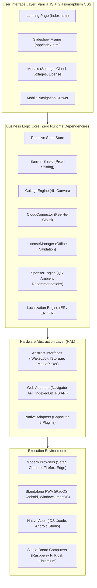

<p align="center">
  
</p>

<p align="center">
  <strong>The intelligent, private, and high-fidelity digital photo frame engineered to transform retired iPads, Android tablets, and dedicated touchscreens into 24/7 gallery displays.</strong>
</p>

<p align="center">
  <a href="README.md"></a>
  <a href="README.es.md"></a>
  <a href="README.fr.md"></a>
</p>

<p align="center">
  <strong>English</strong> • <a href="README.es.md">Español</a> • <a href="README.fr.md">Français</a>
</p>

<p align="center">
  <a href="#-system-architecture"></a>
  <a href="#-upcycling-philosophy"></a>
  <a href="#-zero-knowledge-privacy--security"></a>
  <a href="#-technical-specifications"></a>
  <a href="#-licensing-matrix"></a>
</p>

---

## ✦ Manifesto & Vision

Most commercial digital photo frames are expensive, laggy, fragile, and dependent on proprietary cloud servers that eventually get discontinued or demand mandatory recurring subscriptions. Meanwhile, millions of high-end iPads and tablets sit forgotten in drawers—equipped with gorgeous Retina screens, capable GPUs, and robust batteries.

**leptiumFrame** was created with a production-grade engineering premise:
1. **Upcycling First**: Give an extra 5 to 10 years of useful life to existing hardware while generating zero electronic waste.
2. **Absolute Privacy**: *Zero-Knowledge* architecture. Family photos reside in device local storage or stream peer-to-peer from your personal cloud with zero intermediary servers.
3. **Apple / Android Native Precision**: Visual experience crafted following Apple Human Interface Guidelines—SF Pro typography, deep OLED dark mode, hardware-accelerated Glassmorphism, and zero casual emojis across the UI.
4. **Zero Runtime Dependencies**: Built in pure Vanilla JavaScript (ES2022), semantic HTML5, and modern CSS3 for a continuous 60fps refresh rate with minimal thermal and memory footprint.

---

## ✦ Engineering Pillars

```
┌────────────────────────────────────────────────────────────────────────┐
│                              leptiumFrame                              │
├──────────────────────────────────┬─────────────────────────────────────┤
│  Hardware Abstraction Layer      │  24/7 Screen Protection             │
│  (HAL Ports & Adapters)          │  (Burn-In Shield Pixel-Shifting)    │
├──────────────────────────────────┼─────────────────────────────────────┤
│  Hybrid Direct Privacy           │  4K Collage Assembler               │
│  (Air-Gapped + Peer-to-Cloud)    │  (In-Memory 2x2 Canvas Processing)  │
├──────────────────────────────────┼─────────────────────────────────────┤
│  Capacitive Cleaning Mode        │  Ambient Recommendation Engine      │
│  (30s Vector Touch Lockout)      │  (Zero-Distraction QR Ambient)      │
└──────────────────────────────────┴─────────────────────────────────────┘
```

### 1. Hardware Abstraction Layer (HAL)
The application core adheres to hexagonal architecture (*Ports & Adapters*), cleanly separating the user interface from platform-specific OS APIs:

* **WakeLock**: Keeps the display permanently awake. Uses the standard W3C `navigator.wakeLock` API on modern web browsers and `@capacitor-community/keep-awake` on native iOS/Android builds, handling automatic re-acquisition across lifecycle events (`visibilitychange`, `appStateChange`).
* **Storage**: Persists user settings, favorites, hidden photo lists, and keys using `IndexedDB` with fallback to `localStorage` (Web) or `@capacitor/preferences` (Native).
* **MediaPicker**: Connects to the local gallery using File System Access API / Blob on web, or the native `@capacitor/camera` and `@capacitor/filesystem` photo pickers.

### 2. Anti-Burn-In Shield (24/7 Protection)
To prevent phosphor degradation or image retention on OLED, AMOLED, and IPS LCD panels operating 365 days a year:
* Imperceptibly shifts static UI components (typography clock, weather widgets, controls) by 1 to 2 pixels every 15 minutes in a smooth orbital pattern.
* Applies subtle brightness and contrast modulations during resting hours (configurable night auto-dimming between 10:00 PM and 7:00 AM).

### 3. 2x2 4K Canvas Collage Assembler
* Composes local camera roll pictures or curated shots into high-resolution symmetric grids rendered inside an isolated in-memory HTML5 Canvas.
* Features automatic EXIF orientation normalization, WebKit memory leak prevention, and non-destructive client-side export in print-ready JPEG format.

### 4. Capacitive Cleaning Mode (Apple-Style Clean Overlay)
* Allows wiping dust and fingerprints from the touchscreen with a damp cloth without triggering accidental photo skips or opening menus.
* Temporarily freezes all touch events for 30 seconds, presenting a clean vector countdown timer with tactile unlock confirmation.

---

## ✦ System Architecture



---

## ✦ Zero-Knowledge Privacy & Security

The architecture of **leptiumFrame** prioritizes uncompromising user data ownership:

```
[ Device Camera Roll / Tablet ]  ───────►  [ Browser Sandbox Memory ]  (Zero Outbound Traffic)
                                                         ▲
                                                         │
                                    (Optional: Pro Cloud Connection)
                                                         │
                                           [ Personal Direct Cloud ]
                                (Google Photos, iCloud Public Link, WebDAV)
```

1. **Air-Gapped Mode**: Runs 100% offline. Photos are never uploaded to leptiumFrame servers because the platform intentionally has no image storage backend.
2. **Direct Personal Cloud Sync**: Connects to user-owned shared albums or Nextcloud/WebDAV endpoints directly from browser to cloud (*Peer-to-Cloud*).
3. **Local Credential Storage**: All sync tokens and album URLs remain encrypted within the client device browser sandbox.

---

## ✦ Repository Structure

```
leptiumFrame/
├── index.html                   # Trilingual landing page with checkout and community
├── app/
│   └── index.html               # Fullscreen digital photo frame application
├── src/
│   ├── main.js                  # Modular application bootstrap and entry point
│   ├── core/
│   │   ├── burnin/
│   │   │   └── burnInShield.js  # Micro-pixel orbital shifting algorithm
│   │   ├── collage/
│   │   │   └── collageEngine.js # 2x2 grid assembler and canvas renderer
│   │   ├── cloud/
│   │   │   └── cloudConnector.js# Direct connectors for Google Photos, iCloud, WebDAV
│   │   ├── license/
│   │   │   └── licenseManager.js# Offline license validation and tier state
│   │   ├── ads/
│   │   │   └── sponsorEngine.js # Subtle ambient recommendation engine
│   │   ├── state/
│   │   │   └── store.js         # Reactive state and persistence bridge
│   │   ├── weather/
│   │   │   └── weatherService.js# Dynamic geolocation and weather service
│   │   └── i18n/
│   │       ├── i18n.js          # Lightweight i18n localization engine
│   │       └── locales/
│   │           ├── es.js        # Spanish dictionary
│   │           ├── en.js        # English dictionary
│   │           └── fr.js        # French dictionary
│   ├── hal/
│   │   ├── index.js             # Platform dependency injector (Web vs Native)
│   │   ├── interfaces/          # TypeScript / JSDoc abstract port contracts
│   │   ├── web/                 # Standard W3C web adapters
│   │   └── native/              # Capacitor 8 native adapters (iOS & Android)
│   └── ui/
│       └── styles/
│           ├── main.css         # Glassmorphism app styles
│           └── landing.css      # Landing page styles and responsive UI
├── public/
│   ├── favicon.svg              # Vector digital frame app icon
│   ├── og-image.svg             # High-fidelity vector social banner
│   ├── manifest.webmanifest     # Standalone PWA web manifest
│   ├── sw.js                    # Service Worker with offline caching
│   └── _headers                 # Cloudflare Pages security & permissions headers
├── capacitor.config.json        # Capacitor 8 project configuration
├── vite.config.js               # Vite 5 bundler configuration (relative base)
└── package.json                 # Build scripts and dependencies
```

---

## ✦ Licensing Matrix

leptiumFrame is supported through a transparent, one-time purchase licensing model via **Lemon Squeezy**, avoiding forced recurring subscriptions:

| Feature | Free / Community | Basic | Premium Pro (Recommended) | Maker / Source License |
| :--- | :---: | :---: | :---: | :---: |
| **Price** | **$0** (Free forever) | **$4.99** (One-time) | **$9.99** (One-time) | **$39.00** (One-time) |
| **Ads / QR Recommendations** | Subtle recommendations | Zero ads | Zero ads | Zero ads |
| **Local Photos Limit** | Up to 200 photos | Up to 1,000 photos | **Unlimited** | **Unlimited** |
| **Personal Cloud Sync** | — (Local only) | — (Local only) | **Google Photos, iCloud, WebDAV** | **Included** |
| **24/7 Anti-Burn-In Shield** | — | — | **Active Pixel-Shifting** | **Active Pixel-Shifting** |
| **4K Collage Assembler** | With watermark | With watermark | **Clean 4K Export** | **Clean 4K Export** |
| **Simultaneous Devices** | 1 device | 1 device | **Up to 5 devices** | **Unlimited** |
| **Source Code Access** | — | — | — | **Complete Repository** |
| **Self-Hosting Rights** | — | — | — | **Commercial / DIY** |

---

## ✦ Getting Started & Development

### Prerequisites
* **Node.js**: Version 18.0.0 or higher.
* **NPM**: Version 9.0.0 or higher.

### 1. Clone the Repository
```bash
git clone https://github.com/leptium/leptiumFrame.git
cd leptiumFrame
```

### 2. Install Dependencies
```bash
npm install
```

### 3. Local Development Server
Start the development server with Hot Module Replacement (HMR):
```bash
npm run dev
```
Open `http://localhost:5173/` in your browser to view the landing page or `http://localhost:5173/app/` to load the frame app directly.

### 4. Production Build
Generate the optimized and minified distribution build inside `dist/`:
```bash
npm run build
```

To preview the production build locally:
```bash
npm run preview
```

---

## ✦ Deployment & Target Platforms

### Target 1: PWA Installation on iPad or Android Tablet (Recommended)
1. Open Safari (on iPad) or Chrome (on Android / Fire Tablet) and visit the deployed app URL.
2. Tap the **Share** button (box with upward arrow in iOS, or 3-dots menu in Android).
3. Tap **"Add to Home Screen"**.
4. *(Optional for iPadOS)*: Enable **Guided Access** (*Settings ➔ Accessibility ➔ Guided Access*) and triple-click the top/side button to lock the iPad into dedicated digital frame kiosk mode.

### Target 2: Dedicated Kiosk on Raspberry Pi (Chromium Fullscreen)
Turn any HDMI screen or TV into an intelligent display:
```bash
# Launch Chromium in Kiosk mode with no cursor and disabled info bars
chromium-browser --noerrdialogs --disable-infobars --kiosk http://localhost:5173/app/ &
```

### Target 3: Native Mobile Apps (Capacitor 8)
Compile standalone native iOS (`.ipa`) or Android (`.apk`) binaries:
```bash
# Sync web production assets with native wrappers
npm run build
npm run cap:sync

# Open native Android Studio project
npm run cap:android

# Open native Xcode project (macOS required)
npm run cap:ios
```

---

## ✦ Upcycling Philosophy

The environmental and economic benefit of revitalizing existing hardware instead of buying disposable electronics:

```
Estimated Sustainable Impact Metrics (Per Revived Tablet):
──────────────────────────────────────────────────────────
• Hardware Purchase Cost:      $0.00 USD (100% saved)
• Electronic Waste (WEEE):     0 grams generated
• Operational Lifespan Added:  +5 to 10 active years
• Idle Power Consumption:      ~2 to 4 Watts (Night Mode)
```

---

## ✦ Community & Social Convergence

Did you build a dedicated frame or upcycle an old tablet?
* Share your setup across social media with the **`#leptiumFrame`** hashtag.
* Connect with the official channels:
  * **X (Twitter)**: [@leptiumFrame](https://x.com/leptiumFrame)
  * **Instagram**: [@leptiumFrame](https://instagram.com/leptiumFrame)
  * **GitHub**: [leptium/leptiumFrame](https://github.com/leptium/leptiumFrame)
  * **Reddit**: [r/leptiumFrame](https://reddit.com/r/leptiumFrame)

---

## ✦ License

This software is distributed under a dual model:
* **Personal & Community Use**: Free for home personal use via the hosted PWA or self-compiled local build.
* **Maker / Commercial License**: For commercial deployments, commercial venue self-hosting, or derivative commercial redistribution, acquire a license at [leptiumframe.lemonsqueezy.com](https://leptiumframe.lemonsqueezy.com/buy/maker).

<p align="center">
  <sub>Crafted with technical rigor and sustainable purpose by the <strong>leptiumFrame</strong> team.</sub>
</p>
